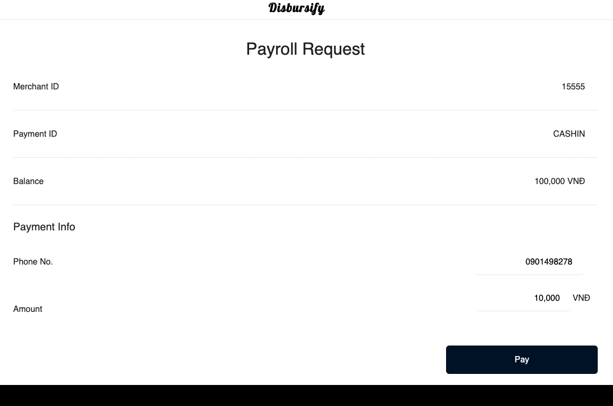

# Quick Start: Disbursement

- [Quick Start: Disbursement](#quick-start-disbursement)
  - [Overview](#overview)
  - [Requirements](#requirements)
  - [Installation](#installation)
  - [Usage](#usage)
  - [Notice](#notice)
  - [Available Scripts](#available-scripts)
    - [`npm run server-dev`](#npm-run-server-dev)
    - [`npm start`](#npm-start)
    - [`npm test`](#npm-test)
    - [`npm build`](#npm-build)
    - [`npm eject`](#npm-eject)
  - [Learn More](#learn-more)
  
## Overview

Disbursement refers to the act of paying out money, typically from a fund or account. ZaloPay offers disbursement feature that enables merchant transfer money to user. For example, the earned money from a campaign can be rewarded to participants, or company payout the employee's salary, etc . . .

This repository includes examples of integrations for online payments with ZaloPay [Disbursement APIs](https://docs.zalopay.vn/en/v2/payments/disbursement/overview.html). Within this Disbursify demo app, you'll find a simplified version of payroll application, complete with commented code to highlight key features and concepts of Disbursement's APIs.



## Requirements

Node.js 12+

## Installation

1. Clone this repo:

```
git clone https://github.com/zalopay-samples/quickstart-node-disbursement.git
```

2. Navigate to the root directory and install dependencies:

```
npm install
```

## Usage

1. Create a `./.env` file with your [Merchant information](https://docs.zalopay.vn/v2/start/). For quickstart, we provide pre-created account that without having to register a new merchant account, [Disburement test app](https://beta-docs.zalopay.vn/docs/developer-tools/testing#test-apps):

```
REACT_APP_APP_ID="your_APP_ID_here"
REACT_APP_PAYMENT_ID="your_PAYMENT_ID_here"
REACT_APP_KEY1="your_KEY1_here"
REACT_APP_PRIVATE_KEY="your_PRIVATE_KEY_here"
```

2. Build & Start the server:

This will create a React production build and start the express server

```
npm run server
```

3. Visit [http://localhost:3000/](http://localhost:3000/) to make a payroll request that pay via ZaloPay using Disbursement APIs.

To try out payment you need install and register ZaloPay Sanbox , see [Trải nghiệm với ZaloPay](https://docs.zalopay.vn/v2/start/#A).

## Notice

This project was bootstrapped with [Create React App](https://github.com/facebook/create-react-app), using the [Redux](https://redux.js.org/) and [Redux Toolkit](https://redux-toolkit.js.org/) template.

## Available Scripts

In the project directory, you can run:

### `npm run server-dev`

Runs the Express app in the development mode.<br />
Open [http://localhost:8080](http://localhost:8080) to view it in the browser.

The server will reload if you make edits.<br />

### `npm start`

Runs the React client side app in the development mode.<br />
Open [http://localhost:3000](http://localhost:3000) to view it in the browser.

The page will reload if you make edits.<br />
You will also see any lint errors in the console.

### `npm test`

Launches the test runner in the interactive watch mode for React client side.<br />
See the section about [running tests](https://facebook.github.io/create-react-app/docs/running-tests) for more information.

### `npm build`

Builds the React client side app for production to the `build` folder.<br />
It correctly bundles React in production mode and optimizes the build for the best performance.

The build is minified and the filenames include the hashes.<br />
Your app is ready to be deployed!

### `npm eject`

**Note: this is a one-way operation. Once you `eject`, you can’t go back!**

If you aren’t satisfied with the build tool and configuration choices, you can `eject` at any time. This command will remove the single build dependency from your project.

Instead, it will copy all the configuration files and the transitive dependencies (Webpack, Babel, ESLint, etc) right into your project so you have full control over them. All of the commands except `eject` will still work, but they will point to the copied scripts so you can tweak them. At this point you’re on your own.

You don’t have to ever use `eject`. The curated feature set is suitable for small and middle deployments, and you shouldn’t feel obligated to use this feature. However we understand that this tool wouldn’t be useful if you couldn’t customize it when you are ready for it.

## Learn More

You can learn more in the [Create React App documentation](https://facebook.github.io/create-react-app/docs/getting-started).

To learn React, check out the [React documentation](https://reactjs.org/).
